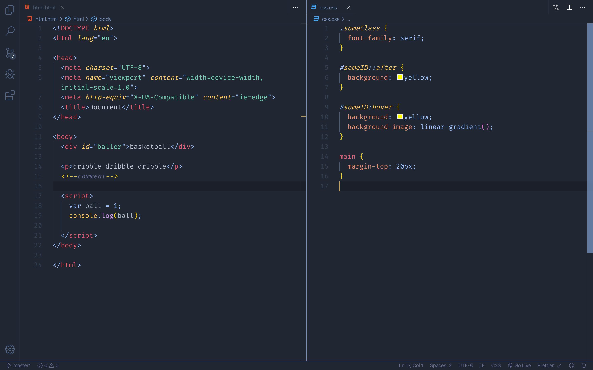

# Dark Frost 🥶

I've grown up on the atlantic coast of canada, and even though I am not a fan being cold I've always loved the colors of winter here. I also love VS Code and theming things, so I thought it would be fun to take a stab at it! Hopefully you enjoy 😄.

Previews

## Installation
- Install Visual Studio Code
- Launch Visual Studio Code
- Choose Extensions from menu
- Search for dark frost
- Click Install to install it
- Click Reload to reload the Code
- From the menu bar click: Code > Preferences > Color Theme > dark frost

## The Rest
I am a first timer at creating themes and making these sort of color decisions, so if you do see anything way out there you can let me know by filing an issue. I will try to get to them as fast as I can 👍🏾. 

## Enjoy!
